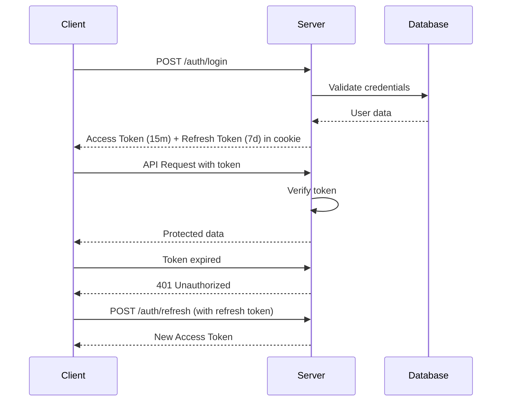

<div align="center">

# ✉️ PenMail

### Connect Through Letters

*A modern online mailing platform to send e-letters to your pen pals around the world*

[](https://nodejs.org/)
[](https://nextjs.org/)
[](https://www.mongodb.com/)
[](https://www.typescriptlang.org/)
[](LICENSE)

[Features](#-features) • [Tech Stack](#-tech-stack) • [Getting Started](#-getting-started) • [API Documentation](#-api-documentation) • [Project Structure](#-project-structure)

</div>

---

## 📖 About

PenMail is a nostalgic yet modern take on pen pal communication. Send e-letters with scheduled delivery, collect stamps from around the world, discover new friends, and experience the joy of letter writing in the digital age.

### ✨ Key Highlights

- 📬 **Scheduled Letter Delivery** - Letters are delivered at scheduled times
- 🎫 **Collectible Stamps** - Earn and collect unique stamps from different countries
- 🌍 **Global Discovery** - Find pen pals based on language, country, and interests
- 🔒 **Secure Authentication** - JWT-based auth with refresh tokens
- 📱 **Real-time Notifications** - Stay updated with instant notifications
- 💾 **Draft System** - Save and edit letters before sending

---

## 🚀 Features

### Authentication & Security
- ✅ User registration and login
- ✅ JWT access & refresh token system
- ✅ Password reset via email
- ✅ Cookie-based authentication
- ✅ Rate limiting on sensitive endpoints
- ✅ Input validation and sanitization

### Letter Management
- ✅ Compose and send letters
- ✅ Inbox and outbox views
- ✅ Draft system (save, edit, send)
- ✅ Archive letters
- ✅ Letter status tracking (draft, sent, received, read)
- ✅ Scheduled delivery system
- ✅ Delete letters

### Friend System
- ✅ Send/accept/reject friend requests
- ✅ View friends list
- ✅ Discover users by country, language, and interests
- ✅ Block/unblock users
- ✅ View friend profiles

### Stamp Collection
- ✅ Browse all available stamps
- ✅ Collect stamps
- ✅ View personal stamp collection
- ✅ Admin stamp management (create, edit, delete)

### Notifications
- ✅ Real-time notification system
- ✅ Unread count tracking
- ✅ Mark as read/unread
- ✅ Mark all as read
- ✅ Delete notifications

### User Profile
- ✅ View and edit profile
- ✅ Avatar upload (Cloudinary integration)
- ✅ Set languages, interests, and country
- ✅ Customizable nickname

### Admin Features
- ✅ User management (view, delete users)
- ✅ Stamp management (create, edit, delete)
- ✅ Role-based access control

---

## 🛠 Tech Stack

### Backend
| Technology | Purpose |
|------------|---------|
|  | Runtime environment |
|  | Web framework |
|  | Database |
|  | ODM |
|  | Authentication |
|  | Image hosting |
|  | Email service |

### Frontend
| Technology | Purpose |
|------------|---------|
|  | React framework |
|  | UI library |
|  | Type safety |
|  | Styling |
|  | HTTP client |

### DevOps & Tools
- **Validation**: express-validator
- **Rate Limiting**: express-rate-limit
- **Task Scheduling**: node-cron
- **File Upload**: Multer
- **Password Hashing**: bcrypt
- **Environment**: dotenv

---

## 📁 Project Structure

```
pen-mail/
├── backend/
│   ├── configs/              # Configuration files
│   │   ├── cloudinary.js     # Cloudinary setup
│   │   └── dbConfig.js       # MongoDB connection
│   ├── controllers/          # Route controllers
│   │   ├── auth/             # Authentication logic
│   │   ├── letter/           # Letter management
│   │   ├── user/             # User operations
│   │   ├── stamp/            # Stamp management
│   │   ├── notification/     # Notification handling
│   │   └── general/          # General routes
│   ├── middlewares/          # Express middlewares
│   │   ├── auth/             # Auth verification
│   │   ├── cloud/            # File upload handling
│   │   ├── validation/       # Input validation
│   │   ├── errorHandler.js   # Global error handler
│   │   └── rateLimiter.js    # Rate limiting
│   ├── models/               # Mongoose schemas
│   │   ├── user/             # User model
│   │   ├── letter/           # Letter model
│   │   ├── stamp/            # Stamp model
│   │   ├── notification/     # Notification model
│   │   ├── friend/           # Friend request model
│   │   └── refreshToken/     # Token model
│   ├── routes/               # API routes
│   │   ├── auth/             # /api/auth
│   │   ├── user/             # /api/user
│   │   ├── letter/           # /api/letter
│   │   ├── stamp/            # /api/stamp
│   │   ├── notification/     # /api/notification
│   │   ├── admin/            # /api/admin
│   │   └── general/          # /api/general
│   ├── services/             # Business logic
│   │   ├── emails/           # Email templates & senders
│   │   ├── schedulers/       # Cron jobs (letter delivery)
│   │   └── template/         # Email templates
│   ├── utils/                # Utility functions
│   │   ├── auth.js           # JWT helpers
│   │   ├── cookie.js         # Cookie management
│   │   ├── logger.js         # Logging utility
│   │   ├── mailer.js         # Email sender
│   │   ├── calcDelay.js      # Delivery calculation
│   │   └── envValidator.js   # Environment validation
│   ├── server.js             # App entry point
│   └── package.json
│
└── frontend/
    ├── src/
    │   ├── app/              # Next.js pages
    │   │   ├── auth/         # Authentication pages
    │   │   │   ├── login/
    │   │   │   └── register/
    │   │   ├── dashboard/    # Protected pages
    │   │   │   ├── compose/  # Write letters
    │   │   │   ├── inbox/    # Received letters
    │   │   │   ├── outbox/   # Sent letters
    │   │   │   ├── friends/  # Friend management
    │   │   │   ├── discover/ # Find pen pals
    │   │   │   └── profile/  # User profile
    │   │   ├── layout.tsx    # Root layout
    │   │   ├── page.tsx      # Landing page
    │   │   └── globals.css   # Global styles
    │   ├── components/       # Reusable components
    │   │   ├── Button.tsx
    │   │   ├── Card.tsx
    │   │   ├── Header.tsx
    │   │   ├── Input.tsx
    │   │   ├── LetterCard.tsx
    │   │   ├── Sidebar.tsx
    │   │   ├── UserCard.tsx
    │   │   └── index.ts
    │   ├── types/            # TypeScript types
    │   │   └── index.ts
    │   └── utils/            # API clients
    │       ├── api.ts        # Base API config
    │       ├── authApi.ts    # Auth endpoints
    │       ├── letterApi.ts  # Letter endpoints
    │       ├── userApi.ts    # User endpoints
    │       ├── stampApi.ts   # Stamp endpoints
    │       ├── notificationApi.ts
    │       ├── adminApi.ts
    │       ├── generalApi.ts
    │       └── config.ts
    ├── next.config.ts
    ├── tsconfig.json
    └── package.json
```

---

## 🏁 Getting Started

### Prerequisites

- **Node.js** v20+ and npm/yarn
- **MongoDB** (local or Atlas)
- **Cloudinary account** (for image uploads)
- **Email service** (Gmail, SendGrid, etc.)

### Backend Setup

1. **Navigate to backend directory**
   ```bash
   cd backend
   ```

2. **Install dependencies**
   ```bash
   npm install
   ```

3. **Create `.env` file**
   ```env
   # Server
   PORT=3000
   NODE_ENV=development
   
   # Database
   MONGODB_URI=mongodb://localhost:27017/penmail
   
   # JWT
   JWT_SECRET=your_jwt_secret_key_here
   JWT_REFRESH_SECRET=your_refresh_secret_key_here
   JWT_EXPIRES_IN=15m
   JWT_REFRESH_EXPIRES_IN=7d
   
   # Client
   CLIENT_URL=http://localhost:3001
   
   # Cloudinary
   CLOUDINARY_CLOUD_NAME=your_cloud_name
   CLOUDINARY_API_KEY=your_api_key
   CLOUDINARY_API_SECRET=your_api_secret
   
   # Email (Nodemailer)
   EMAIL_HOST=smtp.gmail.com
   EMAIL_PORT=587
   EMAIL_USER=your_email@gmail.com
   EMAIL_PASSWORD=your_app_password
   EMAIL_FROM=PenMail <noreply@penmail.com>
   ```

4. **Start the server**
   ```bash
   # Development mode
   npm run dev
   
   # Production mode
   npm start
   ```

5. **Server runs on** `http://localhost:3000`

### Frontend Setup

1. **Navigate to frontend directory**
   ```bash
   cd frontend
   ```

2. **Install dependencies**
   ```bash
   npm install
   ```

3. **Create `.env.local` file**
   ```env
   NEXT_PUBLIC_API_URL=http://localhost:3000/api
   ```

4. **Start the development server**
   ```bash
   npm run dev
   ```

5. **Frontend runs on** `http://localhost:3001`

### 🎯 Quick Start

```bash
# Terminal 1: Start Backend
cd backend && npm run dev

# Terminal 2: Start Frontend
cd frontend && npm run dev
```

Visit `http://localhost:3001` and start connecting with pen pals! ✉️

---

## 📡 API Documentation

### Base URL
```
http://localhost:3000/api
```

### Authentication Endpoints

| Method | Endpoint | Description | Auth |
|--------|----------|-------------|------|
| POST | `/auth/register` | Register new user | ❌ |
| POST | `/auth/login` | User login | ❌ |
| POST | `/auth/logout` | User logout | ✅ |
| POST | `/auth/forgot-password` | Request password reset | ❌ |
| POST | `/auth/reset-password/:token` | Reset password | ❌ |

### User Endpoints

| Method | Endpoint | Description | Auth |
|--------|----------|-------------|------|
| GET | `/user/profile` | Get current user profile | ✅ |
| PUT | `/user/update` | Update profile (with avatar) | ✅ |
| GET | `/user/discover` | Discover users | ✅ |
| GET | `/user/get-friends` | Get friends list | ✅ |
| GET | `/user/get-friends/:friendId` | Get friend profile | ✅ |
| PUT | `/user/connect-friend/:friendId` | Send friend request | ✅ |
| DELETE | `/user/unfriend/:friendId` | Remove friend | ✅ |
| GET | `/user/friend-requests` | Get pending requests | ✅ |
| PUT | `/user/friend-request/:requestId` | Accept request | ✅ |
| DELETE | `/user/friend-request/:requestId` | Reject request | ✅ |
| DELETE | `/user/friend-request/cancel/:requestId` | Cancel request | ✅ |
| PUT | `/user/block/:userId` | Block user | ✅ |
| DELETE | `/user/unblock/:userId` | Unblock user | ✅ |
| GET | `/user/blocked-users` | Get blocked users | ✅ |

### Letter Endpoints

| Method | Endpoint | Description | Auth |
|--------|----------|-------------|------|
| POST | `/letter/send-letter` | Send new letter | ✅ |
| GET | `/letter/inbox` | Get inbox letters | ✅ |
| GET | `/letter/outbox` | Get sent letters | ✅ |
| GET | `/letter/get-letter/:id` | Get single letter | ✅ |
| DELETE | `/letter/delete-letter/:id` | Delete letter | ✅ |
| GET | `/letter/drafts` | Get draft letters | ✅ |
| PUT | `/letter/draft/:id` | Update draft | ✅ |
| POST | `/letter/draft/:id/send` | Send draft | ✅ |
| PUT | `/letter/archive/:id` | Archive letter | ✅ |
| PUT | `/letter/unarchive/:id` | Unarchive letter | ✅ |
| GET | `/letter/archived` | Get archived letters | ✅ |

### Stamp Endpoints

| Method | Endpoint | Description | Auth |
|--------|----------|-------------|------|
| GET | `/stamp/` | Get all stamps | ✅ |
| POST | `/stamp/collect/:stampId` | Collect stamp | ✅ |
| GET | `/stamp/my-stamps` | Get collected stamps | ✅ |

### Notification Endpoints

| Method | Endpoint | Description | Auth |
|--------|----------|-------------|------|
| GET | `/notification/` | Get all notifications | ✅ |
| GET | `/notification/unread-count` | Get unread count | ✅ |
| PUT | `/notification/:notificationId/read` | Mark as read | ✅ |
| PUT | `/notification/mark-all-read` | Mark all as read | ✅ |
| DELETE | `/notification/:notificationId` | Delete notification | ✅ |

### Admin Endpoints

| Method | Endpoint | Description | Auth |
|--------|----------|-------------|------|
| GET | `/admin/user/all` | Get all users | ✅ Admin |
| GET | `/admin/user/:userId` | Get user details | ✅ Admin |
| DELETE | `/admin/user/:userId` | Delete user | ✅ Admin |
| POST | `/admin/stamp/create` | Create stamp | ✅ Admin |
| PUT | `/admin/stamp/edit/:stampId` | Edit stamp | ✅ Admin |
| DELETE | `/admin/stamp/delete/:stampId` | Delete stamp | ✅ Admin |
| GET | `/admin/stamp/all` | Get all stamps | ✅ Admin |

### Health Check

| Method | Endpoint | Description | Auth |
|--------|----------|-------------|------|
| GET | `/health` | Server health status | ❌ |

---

## 🔐 Authentication Flow



---

## 🎨 Frontend Pages

### Public Pages
- **Landing Page** (`/`) - Hero section with features
- **Login** (`/auth/login`) - User authentication
- **Register** (`/auth/register`) - User registration

### Protected Dashboard Pages
- **Dashboard** (`/dashboard`) - Overview with stats
- **Compose** (`/dashboard/compose`) - Write new letters
- **Inbox** (`/dashboard/inbox`) - Received letters
- **Outbox** (`/dashboard/outbox`) - Sent letters
- **Friends** (`/dashboard/friends`) - Friend management
- **Discover** (`/dashboard/discover`) - Find pen pals
- **Profile** (`/dashboard/profile`) - Edit user profile

---

## 🧩 Key Features Explained

### 📬 Scheduled Letter Delivery
Letters aren't delivered instantly - they have scheduled delivery times calculated based on sender and recipient locations, simulating real postal mail.

### 🎫 Stamp Collection System
- Users collect stamps when sending/receiving letters
- Each stamp has unique designs and country origins
- Admins can create and manage stamp collections

### 🔔 Real-time Notifications
- Friend requests
- New letters received
- Letter delivery confirmations
- System announcements

### 🛡 Security Features
- Password hashing with bcrypt
- JWT access & refresh tokens
- HTTP-only cookies
- Rate limiting on auth routes
- Input validation and sanitization
- Protected routes with middleware

---

## 🤝 Contributing

Contributions are welcome! Please follow these steps:

1. Fork the repository
2. Create a feature branch (`git checkout -b feature/AmazingFeature`)
3. Commit your changes (`git commit -m 'Add some AmazingFeature'`)
4. Push to the branch (`git push origin feature/AmazingFeature`)
5. Open a Pull Request

---

## 📝 License

This project is licensed under the MIT License - see the [LICENSE](LICENSE) file for details.

---

## 👨‍💻 Author

**PenMail Team**

---

## 🙏 Acknowledgments

- Inspired by traditional pen pal culture
- Built with modern web technologies
- Designed for nostalgia and connection

---

<div align="center">

**Made with ❤️ for pen pal enthusiasts worldwide**

[⬆ Back to Top](#-penmail)

</div>